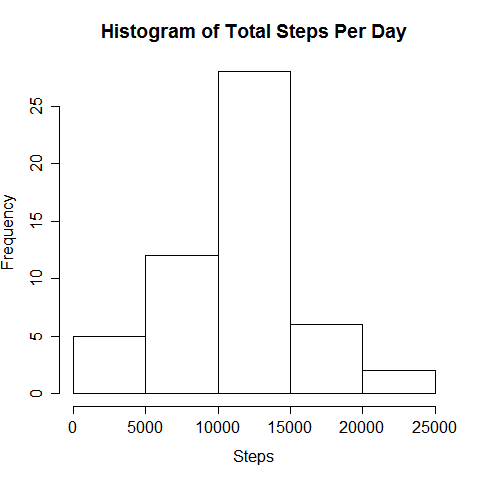
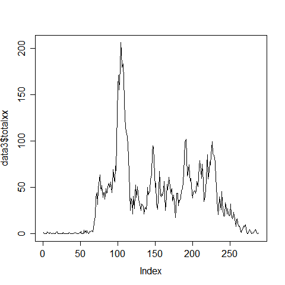
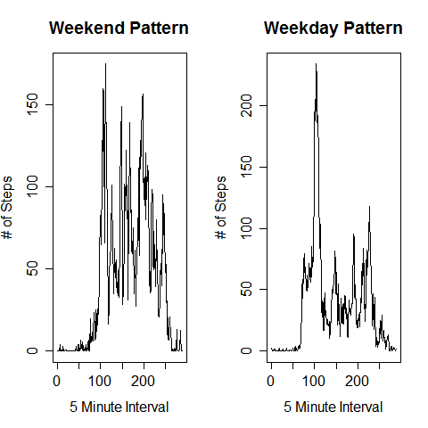

knit2html("PA1_template.rmd")

---
title: "PA1_template"
author: "Seth Appel"
date: "November 13, 2015"
output: 
  html_document
    keep_md:yes
---

First we need to load two pacakges into our R environment to enable our analysis.   I will be using dplyr to quickly sort data and timedate to  enable some simple calendar sorting functions.

```{r}
data<- read.csv("activity.csv")
library("dplyr")
library("timeDate")
```

Now let us make a histogram of the total number of steps per day Basically we are plotting our the distribution of the frequency of daily totals across the data set

```{r}
## Histogram of Total Steps Per Day
par(mfrow=c(1,1))    ## I reset the plot table in case we run the code multiple times
data2 <- data %>% group_by (date) %>% 
  summarise(totalx=sum(steps), na.rm=TRUE)   
data2 <- filter(data2, !is.na(data2$total))  ## Removing rows with missing values
hist(data2$totalx,main="Histogram of Total Steps Per Day", 
     xlab="Steps")
```
 


Very close to a classic bell curve  I guess there is a normal distibution of activity ranging from coach potatoes to outdoorsy types

Hey what's the mean and median of the total steps

```{r}
## mean and median

meanx<- mean(data2$totalx)
medianx <- median(data2$totalx)
print(paste("Mean of total steps:",round(meanx)))
print(paste("Median of total steps:",medianx))     
```
[1] "Mean of total steps: 10766"
[1] "Median of total steps: 10765"


Now let us do a plot showing the mean number of steps across the entire data set for each five minute interval  Might be interesting to see when people get active 


```{r}
##  five minute interval analysis
data3 <- filter(data,!is.na(data$steps)) %>% group_by (interval) %>%
summarise(totalxx=mean(steps),na.rm=TRUE)
plot(data3$totalxx, type="l")

```
 

Wow There is an interesting spike in activity in the middle of our plot followed by various smaller jumps tapering off until our sample population seems to be watching TV before finally falling asleep

Which interval is the most active with the most steps

```{r}
## Max interval with most steps
maxx <- which.max(data3$totalxx)
print(paste("Most Active Interval is",data3[maxx,1],"with",round(data3[maxx,2]),"steps"))
```

[1] "Most Active Interval is 835 with 206 steps"

But perhaps a lot of missing data is distorting our findings
How much of the data is actually missing

```{r}
## Assess portion of NA
all <- length(data$steps)
missing <- all - length(data$steps[!is.na(data$steps)])
print(paste("Total length of the data set is",all,"observations."))
print(paste("There are",missing,"observations with missing data (NA)"))
print(paste(round(missing/all,2),"of the obs are missing data"))
```
[1] "Total length of the data set is 17568 observations."
[1] "There are 2304 observations with missing data (NA)"
[1] "0.13 of the obs are missing data"


That is a good deal of missing data  I am going to replace those missing values by replacing each missing point with the average across the entire five minute interval that we created earlier

```{r}
## Replace NA with average values
q<-merge(data,data3, by="interval")
data4<- data
for (i in 1:length(data$steps)) {
  if (is.na(data[i,1])) {data4[i,1]<-q[i,4]}
}
```

Now let us make a histogram of the new data set that has been pumped up with the new data

```{r}
## Histogram of Total Steps Per Day - New all present data

data5 <- data4 %>% group_by (date) %>% 
  summarise(totalx=sum(steps), na.rm=TRUE)
data5 <- filter(data2, !is.na(data2$total))
hist(data5$totalx,main="Histogram of Total Steps Per Day with Missing Data Inputed", 
     xlab="Steps")


```
 

And let us take a look at the mean and median of the new data


```{r}

## mean and median - all present data
meanxx<- mean(data5$totalx)
medianxx <- median(data5$totalx)
print(paste("Mean of total steps (missing obs replaced):",round(meanxx)))
print(paste("Median of total steps:(missing obs replaced):",medianxx))  

```
[1] "Mean of total steps (missing obs replaced): 10766"
[1] "Median of total steps:(missing obs replaced): 10765"

Now let us see if bundling all the days of the week together has been distorting some key findings.  We will need to create a simple test for weekend or weekdays and sort the data accordingly


```{r}
## Add weekend or weekday indicator
weekend<-numeric()
data$date <- as.POSIXct(data$date,format="%m/%d/%Y")
for (i in 1:length(data$date)) {
  if (isWeekend(data[i,2])) {
    weekend<-c(weekend,1)
    } else {
    weekend<-c(weekend,0)}
}
data<- cbind(data,weekend)

## Create seperate week end and week day data sets
wkend <- filter(data,data$weekend==1)
wkday<- filter(data,data$weekend==0)
```


And now let's plot it


```{r}
##  five minute interval analysis panel plot weekend versus weekday
data6 <- filter(wkend,!is.na(wkend$steps)) %>% group_by (interval) %>%
  summarise(totalxx=mean(steps),na.rm=TRUE)
data7 <- filter(wkday,!is.na(wkday$steps)) %>% group_by (interval) %>%
  summarise(totalxx=mean(steps),na.rm=TRUE)

par(mfrow=c(1,2))
plot(data6$totalxx, type="l", ylab="# of Steps",xlab="5 Minute Interval", main="Weekend Pattern")
plot(data7$totalxx, type="l",ylab="# of Steps",xlab="5 Minute Interval",main="Weekday Pattern")

```
 

We can see an initial morning burst of activity for everyday, but on the weekdays people hunker down by their desks and are pretty sedentar.
We see people are much more active all day long during the weekend

I guess the sample population are office workers as we would see much more activity for people working as field hands or construction workers
